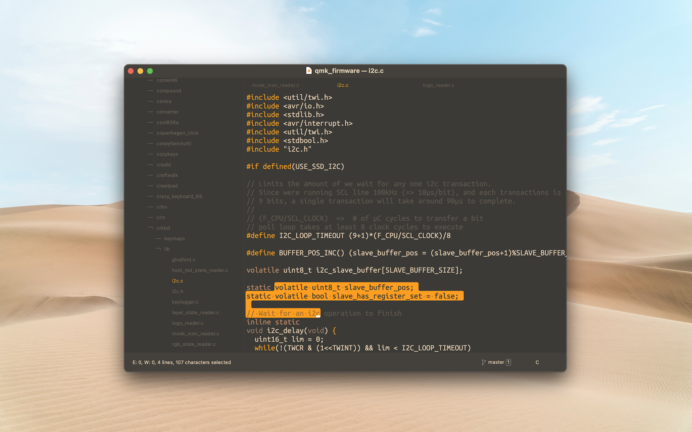

# Sand Storm

A dark minimal theme for Sublime Text.



# Installation

Copy the "Theme - Sandstorm" folder to the packages directory.

- on MacOS: _/Users/<username>/Library/Application Support/Sublime Text/Packages/_

Select the theme in Sublime Text from the _command palette_:

- UI: Select Theme
- UI: Select Color Scheme

# Recommended settings

This theme works great with some minimalistic settings. Do not follow these ones blindly, try on your own and tweak them as you want.

Where is the _preferences_ file?

- on MacOS: _/Users/<username>/Library/Application Support/Sublime Text/Packages/User/Preferences.sublime-settings_

```json
{
    "always_show_minimap_viewport": false,
    "block_caret": true,
    "caret_extra_bottom": 0,
    "caret_extra_top": 0,
    "caret_extra_width": 3,
    "caret_style": "solid",
    "draw_indent_guides": false,
    "draw_shadows": false,
    "gutter": false,
    "hide_tab_scrolling_buttons": true,
    "highlight_line": true,
    "line_numbers": true,
    "menu_hide": true,
    "reveal_menu": false,
    "rulers": [],
    "show_tab_close_buttons": false,
    "show_sidebar_button": false,
    "hide_new_tab_button": true,
    "show_indentation": false,
    "scroll_context_lines": 4,
}
```

